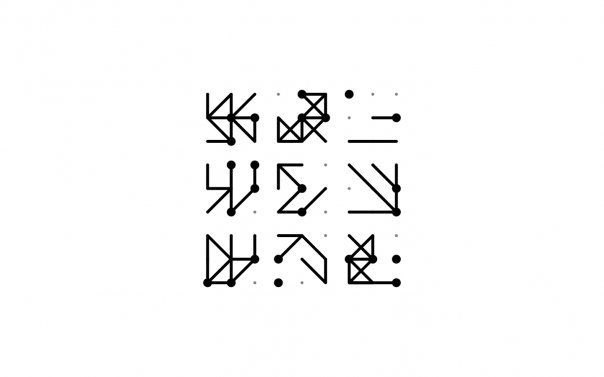
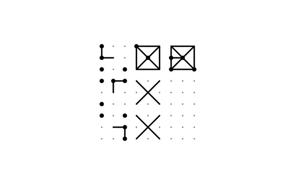

# ravenslike

MATLAB->Rust implementation of an experimental stimulus protocol for Raven's Advanced Progressive Matrices

## Previous implementation

This problem was a very early MATLAB programming contract for me (just post-undergrad) in G. Schauer's lab at UCLA. 
Research subjects attempt to discern rules from "solved" matrices and apply them to partially completed matrices.

## New implementation

Planning to use `nannou` for graphics handling in Rust.
